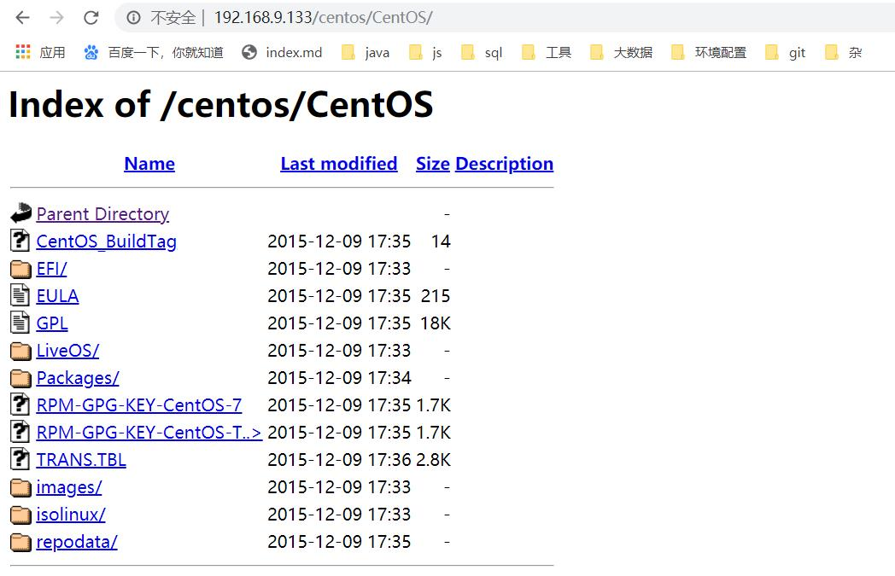

# Cluster-yum源
这一步是在[单机版yum源配置](./yum.md)成功的基础上做的  
### 参考：  
1. [最简法搭建局域网CentOS7 共享YUM源](https://www.jianshu.com/p/ff63d6ab2000)

### 1. 创建目录
`mkdir /var/www/html/centos`
### 2. 建立软连接
`ln -s /media/CentOS /var/www/html/centos`
### 3. 开启http服务
`systemctl restart httpd`
### 4. 浏览器访问

### 5. 设置http服务开机自启
`systemctl enable httpd.service`
### 6. 切换到需要配置yum源的机器上
+ `vi /etc/yum.repos.d/CentOS-Media.repo`
+ 增加地址`http://cdh01/centos/CentOS/`，修改`enabled=0`

```
[c7-media]
name=CentOS-$releasever - Media
baseurl=http://cdh01/centos/CentOS/
        file:///media/CentOS/
        file:///media/cdrom/
        file:///media/cdrecorder/
        file:///dvd
gpgcheck=1
enabled=0
gpgkey=file:///etc/pki/rpm-gpg/RPM-GPG-KEY-CentOS-7
````

### 7. 测试
`yum install XXX`