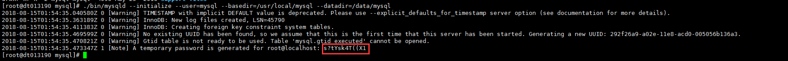

# 安装mysql
[第一个参考](./index.md)中的安装没有错误
### 1. 下载mysql  
[官网地址](https://dev.mysql.com/downloads/mysql/)
### 2. 创建日志和数据目录  
```
[root@cdh01 /]# mkdir data
[root@cdh01 /]# cd data
[root@cdh01 data]# mkdir mysql-5.7.27
[root@cdh01 data]# mkdir log
[root@cdh01 data]# cd log
[root@cdh01 log]# mkdir mysql-5.7.27
[root@cdh01 log]# cd mysql-5.7.27
[root@cdh01 mysql-5.7.27]# touch mysql.err
```  
data和log具体放在哪个目录下，根据个人习惯而定
### 3. 创建mysql用户和用户组  
+ 创建mysql组  
	`groupadd mysql`
+ 创建mysql用户  
	`useradd -s /bin/bash -g mysql -d /home/mysql mysql`  
	(这个我没有试，应该可以这么写，简书的那篇博客中，创建的是系统账户，所以我没用)  

### 4. 解压  
把刚从官网下载的mysql上传到centos上
+ 解压到`/usr/local/`目录下  
	`[root@cdh01 resource]# tar -zxvf mysql-5.7.27-el7-x86_64.tar.gz -C /usr/local/`
+ 改名  
	`[root@cdh01 /]# mv /usr/local/mysql-5.7.27-el7-x86_64 /usr/local/mysql-5.7.27`  

### 5. 更改权限
+ 安装包  
	`/usr/local/mysql-5.7.27`
	```
	cd /usr/local/mysql-5.7.27
	chown -R mysql .
	chgrp -R mysql .
	```
+ 数据  
	```
	cd /data/mysql-5.7.27
	chown -R mysql:mysql /data/mysql-5.7.27
	```
+ 日志  
	```
	cd /data/log/mysql-5.7.27
	chown -R mysql:mysql /data/log/mysql-5.7.27
	```

### 6. 初始化mysql  
 `/usr/local/mysql-5.7.27/bin/mysqld --initialize --user=mysql --basedir=/usr/local/mysql-5.7.27 --datadir=/data/mysql-5.7.27`

   

### 7. 生成RSA
`/usr/local/mysql-5.7.27/bin/mysql_ssl_rsa_setup  --datadir=/data/mysql-5.7.27`
### 8. 配置my.cnf
+ 进入support-files目录  
`cd /usr/local/mysql-5.7.27/support-files`
+ 配置my.cnf
	- 有的目录下没有这个文件，自己建一个  
	`touch my-default.cnf`
	- 编辑内容  
	[传送门](../conf/my-default.md)
	- 复制到/etc/目录下  
	`cp /usr/local/mysql-5.7.27/support-files/my-default.cnf /etc/my.cnf`

### 9. 不知道干嘛的
+ 
```
cp /usr/local/mysql-5.7.27/support-files/mysql.server /etc/init.d/mysql
```  
+ `vi /etc/init.d/mysql`  
修改：  
```
basedir=/usr/local/mysql-5.7.27
datadir=/data/mysql-5.7.27
```

### 10. 运行mysql服务
`/usr/local/mysql-5.7.27/bin/mysqld_safe --user=mysql &`  

出现下面输出就启动成功：  
```
[root@cdh01 mysql-5.7.27]# ./bin/mysqld_safe --user=mysql &
[1] 14028
[root@cdh01 mysql-5.7.27]# 2019-08-15T17:34:35.466017Z mysqld_safe Logging to '/data/log/mysql-5.7.27/mysql_3306.err'.
2019-08-15T17:34:35.491147Z mysqld_safe Starting mysqld daemon with databases from /data/mysql-5.7.27
```
### 11. 进入mysql命令行
+ `/usr/local/mysql-5.7.27/bin/mysql --user=root -p`
+ 输入前面记下的密码
+ 出现下面输出表示成功:
```
[root@cdh01 mysql-5.7.27]#  ./bin/mysql --user=root -p
Enter password:
Welcome to the MySQL monitor.  Commands end with ; or \g.
Your MySQL connection id is 3
Server version: 5.7.27
Copyright (c) 2000, 2019, Oracle and/or its affiliates. All rights reserved.
Oracle is a registered trademark of Oracle Corporation and/or its
affiliates. Other names may be trademarks of their respective
owners.
Type 'help;' or '\h' for help. Type '\c' to clear the current input statement.
mysql>
```


+ 修改密码
```
mysql> set password=password('root');
Query OK, 0 rows affected, 1 warning (0.00 sec)
mysql> exit
Bye
```

+ 允许远程访问
```
mysql> grant all privileges on *.* to root@'%' identified by 'root';
Query OK, 0 rows affected, 1 warning (0.00 sec)
```

+ 刷新授权表
```
mysql> flush privileges;
Query OK, 0 rows affected (0.00 sec)
```

### 12. 安装完成

### 13. 配置环境变量
```
vi /etc/profile
export PATH=/usr/local/mysql-5.7.27/bin:$PATH
source /etc/profile
```
### 14. 配置开机自启
```
chmod 755 /etc/init.d/mysql
chkconfig --add mysql --将MySQL添加为受chkconfig管理的服务
chkconfig --level 345 mysql on --在级别3和5上设定服务为”on”
```