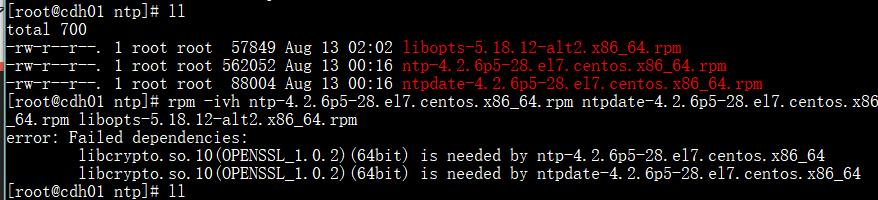

# 配置NTP时间同步服务
注意：这里使用配置本地[yum源](./cluster-yum.md)  
下面方法不建议  
参考：[centos7.5 离线安装ntp服务](https://www.cnblogs.com/magic-chenyang/p/10968488.html)
+ 检查rpm包  
`rpm -qa | grep ntp`
+ 本地以前装过，删掉，怎么删服务，还没发现
` yum remove ntpdate-4.2.6p5-22.el7.centos.x86_64`
+ 下载rpm包，[https://pkgs.org/download/ntp](https://pkgs.org/download/ntp)
```
ntp-4.2.6p5-28.el7.centos.x86_64.rpm 
ntpdate-4.2.6p5-28.el7.centos.x86_64.rpm 
libopts-5.18.12-alt2.x86_64.rpm
```
+ 安装rpm包  
`rpm -ivh ntp-4.2.6p5-28.el7.centos.x86_64.rpm ntpdate-4.2.6p5-28.el7.centos.x86_64.rpm libopts-5.18.12-alt2.x86_64.rpm`  
报错

查看本机openssl版本`openssl version -v`  
  
发现这个错误是由于openssl版本太低，ntp需要的是1.0.2，[升级openssl](./upOpenssl.md)
+ 万万没想到openssl安装后，还是有问题，这里不推荐使用rpm包安装了，建议[修改yum源](./yum.md)，由于我们是集群，不可能在每一台机器上都配置一个yum源，所以这里[集群配置yum源](./cluster-yum.md)
	- yum安装
	`yum -y install ntp`
	- 修改配置
	centos7的ntp配置文件在`etc/ntp.conf`，参考 [centos7 ntp服务器配置](https://www.cnblogs.com/harrymore/p/9566229.html)