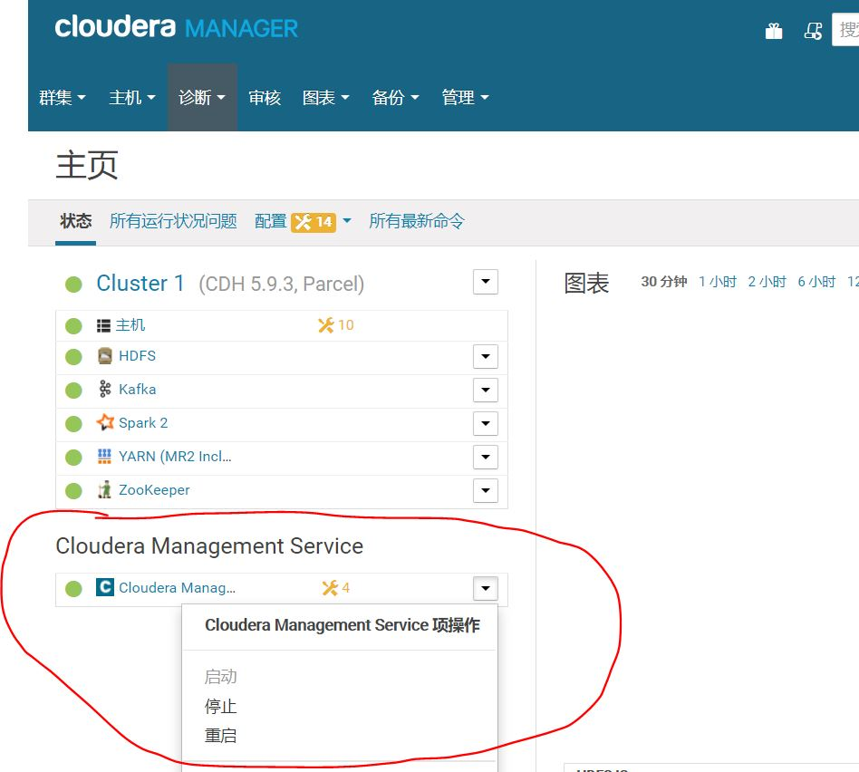
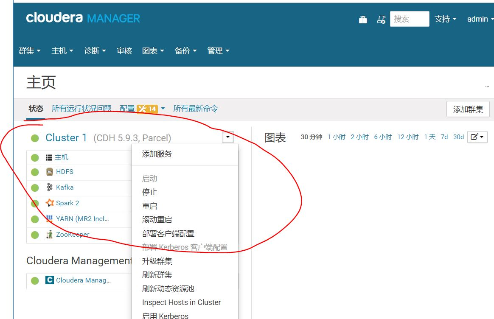

# CDH

## 集群配置
主机名|IP|用户名|密码|部署服务
:-:|:-:|:-:|:-:|:-
cdh1|192.168.9.12|root|123.com|启动脚本
cdh2|192.168.9.13|root|123.com|Yarn、Spark2、HBase、Zookeeper
cdh3|192.168.9.14|root|123.com|Yarn、Spark2、HBase、Zookeeper
cdh4|192.168.9.15|root|123.com|Yarn、Spark2、HBase、Zookeeper
cdh5|192.168.9.16|root|123.com|Yarn、Spark2、Hbase
cdh6|192.168.9.17|root|123.com|Yarn、Spark2、Hbase
cdh7|192.168.9.10|root|123.com|Yarn、Spark2、Hbase
cdh8|192.168.9.9|root|123.com|Yarn、Spark2、Hbase、Kafka
cdh9|192.168.9.8|root|123.com|Yarn、Spark2、Hbase、Kafka
cdh10|192.168.9.7|root|123.com|Yarn、Spark2、Hbase、Kafka
cdh11|192.168.9.6|root|123.com|Yarn、Spark2、Hbase
cdh12|192.168.9.5|root|123.com|Yarn、Spark2、Hbase

## 启动
1. 登录cdh1
2. 执行脚本cdh.sh  
`./cdh.sh start`
3. 登录CDH web管理工具  
浏览器输入： `cdh1:7180`  
user: `admin`  
password:`admin`  
4. 启动 Cloudera Management Service  

5. 启动Cluster  

## 关闭
1. 登录CDH web管理工具  
浏览器输入： `cdh1:7180`  
user: `admin`  
password:`admin`  
2. 停止 Cloudera Management Service  

3. 停止 Cluster  

4. 登录cdh1
5. 执行脚本cdh.sh  
`./cdh.sh stop`