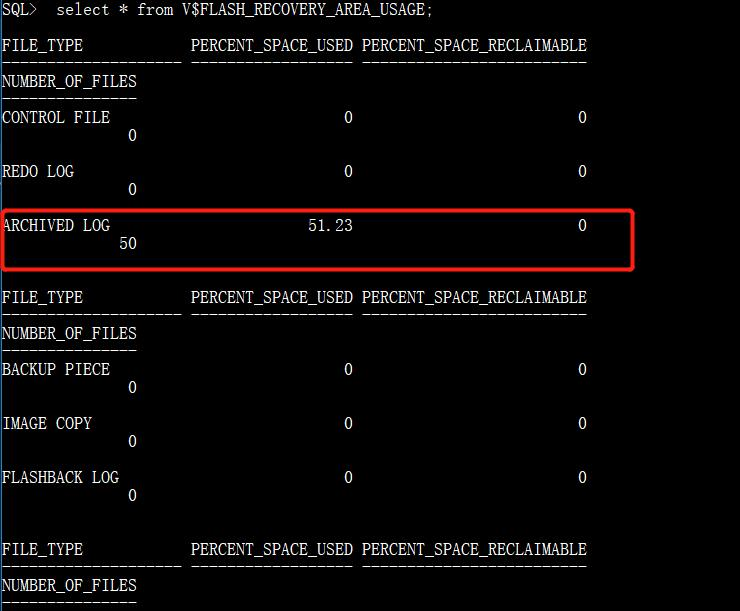
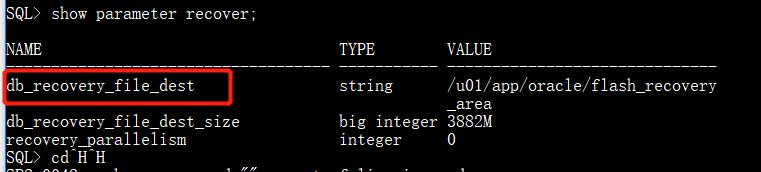

# ORACLE
cdh所用roacle  
参考：  
1. [关于ORA-00257: archiver error. Connect internal only, until freed 错误的处理方法](https://blog.csdn.net/cw370008359/article/details/51023794)

## 节点配置
主机名|IP|用户名|密码|端口|安装位置
:-:|:-:|:-:|:-:|:-:|:-:
localhost|192.168.9.19|root|123.com|1521|/u01/app/oracle

## start
#### 启动监听
1. 切换到oracle用户  
`su - oracle`
1. 查看监听状态  
`lsnrctl status`  
2. 启动监听  
`lsnrctl start`
3. 查看监听是否启动  
4. 关闭监听  
`lsnrctl stop`

#### 启动服务
1. 打开登录窗口  
`sqlplus /nolog`
2. 以管理员身份登录  
`connect /as sysdba`
3. 启动实例  
`startup`
```
[oracle@localhost ~]$ sqlplus /nolog
SQL*Plus: Release 11.2.0.1.0 Production on Tue Sep 3 15:38:09 2019
Copyright (c) 1982, 2009, Oracle.  All rights reserved.
SQL> conn / as sysdba
Connected to an idle instance.
SQL> startup
ORACLE instance started.
Total System Global Area 1586708480 bytes
Fixed Size                  2213736 bytes
Variable Size            1073744024 bytes
Database Buffers          503316480 bytes
Redo Buffers                7434240 bytes
Database mounted.
Database opened.
SQL>
```

## stop

## FAQ
1. `archiver error. Connect internal only, until freed`  
发生错误的原因参考1中已经表达的很清楚，这里介绍一下15楼的解决过程
	+ 远程登录192.168.9.19
	+ 切换oracle用户  
```
[root@localhost ~]# su - oracle
上一次登录：一 8月 19 15:29:32 CST 2019pts/0 上
[oracle@localhost ~]$
```
	+ 打开登录窗口  
```
[oracle@localhost ~]$ sqlplus /nolog
SQL*Plus: Release 11.2.0.1.0 Production on Mon Aug 19 18:07:40 2019
Copyright (c) 1982, 2009, Oracle.  All rights reserved.
SQL>
```
	+ 以管理员身份登录  
```
SQL> connect /as sysdba
Connected.
```
	+ 检查flash recovery area的使用情况  
`SQL>  select * from V$FLASH_RECOVERY_AREA_USAGE;`  

	  
	(这里显示的已用百分比才51.23，不知道为什么会出现问题，反正按这个方法处理后，问题解除)
	+ 查询文档目录位置  
	`SQL> show parameter recover;`
	
	+ 删除文档
	登录root用户  
	进入上一步查找到的文档目录  
	`cd /u01/app/oracle/flash_recovery_area`  
	进入对应的实例，进入archivelog目录  
	`cd /u01/app/oracle/flash_recovery_area/ORACLE/archivelog`  
	全部删掉（正式环境建议备份）  
	`[root@localhost archivelog]# rm -rf *`
	+ 用RMAN维护控制文件，释放空间
	使用oracle登录，进入RMAN维护模式  
	```
	[root@localhost /]$ su - root
	[oracle@localhost /]$ rman target sys/pass
	```  
	检查无用的archivelog
	`RMAN>  crosscheck archivelog all;`  
	删除截止到前一天的所有archivelog  
	`RMAN> delete archivelog until time 'sysdate-1';`  
	+ 再次查询flash recovery area的使用情况  
	（按照步骤1来进行）  
	+ 问题解决