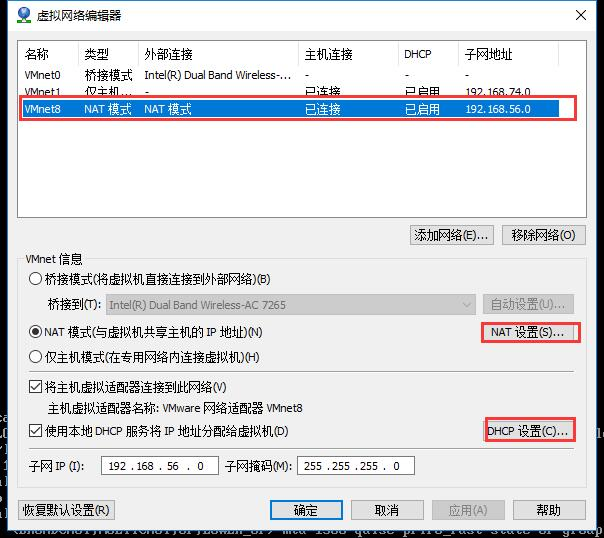
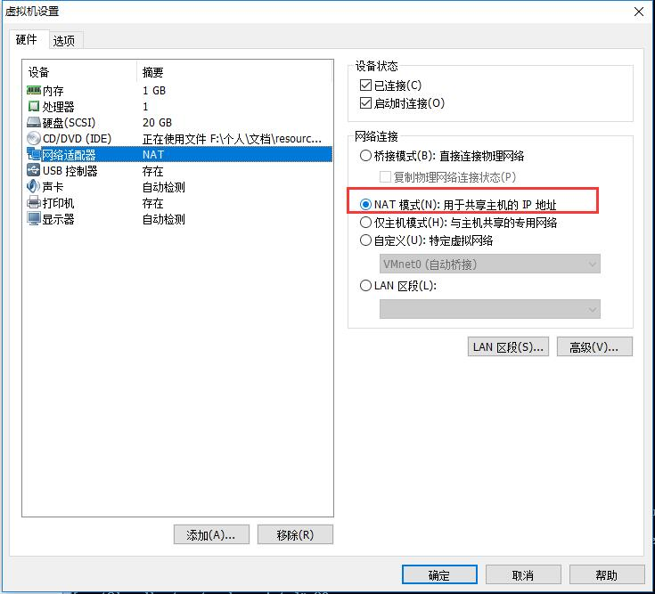

# NAT模式(Network Address Translation)
#### 网卡编辑
1. NAT-虚拟网卡编辑  
  

2. NAT-虚拟网卡编辑-NAT  
  

3. NAT-虚拟网卡编辑-DHCP  
    

#### 虚拟机网络设置  
 

#### 网卡配置文件
**这里配置了DHCP和static**  
1. dhcp    
  

```
TYPE=Ethernet
PROXY_METHOD=none
BROWSER_ONLY=no
BOOTPROTO=dhcp
DEFROUTE=yes
IPV4_FAILURE_FATAL=no
IPV6INIT=yes
IPV6_AUTOCONF=yes
IPV6_DEFROUTE=yes
IPV6_FAILURE_FATAL=no
IPV6_ADDR_GEN_MODE=stable-privacy
NAME=ens33
UUID=5313be4c-aa06-4977-ac6d-cce72ca57416
DEVICE=ens33
ONBOOT=yes
```
2. static  
  

```
TYPE=Ethernet
PROXY_METHOD=none
BROWSER_ONLY=no
BOOTPROTO=static
DEFROUTE=yes
IPV4_FAILURE_FATAL=no
IPV6INIT=yes
IPV6_AUTOCONF=yes
IPV6_DEFROUTE=yes
IPV6_FAILURE_FATAL=no
IPV6_ADDR_GEN_MODE=stable-privacy
NAME=ens33
UUID=5313be4c-aa06-4977-ac6d-cce72ca57416
DEVICE=ens33
ONBOOT=yes
IPADDR=192.168.56.129
NETMASK=255.255.255.0
GATEWAY=192.168.56.2
DNS1=114.114.114.114
DNS2=114.114.114.115
```

#### 测试