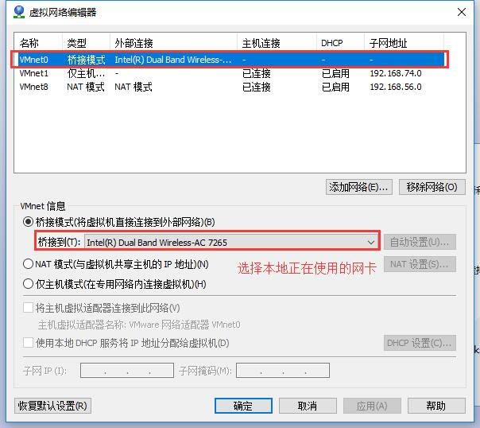
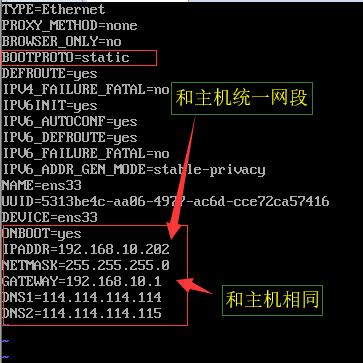

# 桥接模式
#### 1. 绑定网卡  
 
#### 2. 虚拟机网络设置  
 这里尝试过直接选桥接模式，没有成功，所以选择自定义  
 
#### 3. 编辑网卡配置文件  
 `vi /etc/sysconfig/network-scripts/ifcfg-ens33`  
 
#### 4. 重启网络服务  
 `systemctl restart network.service`
#### 5. 测试