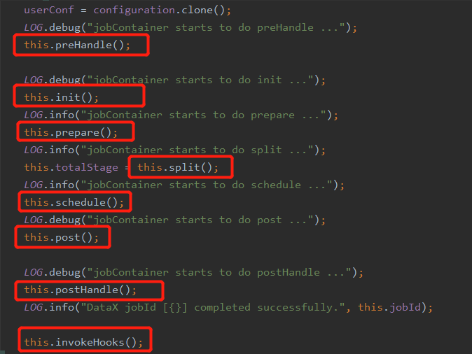
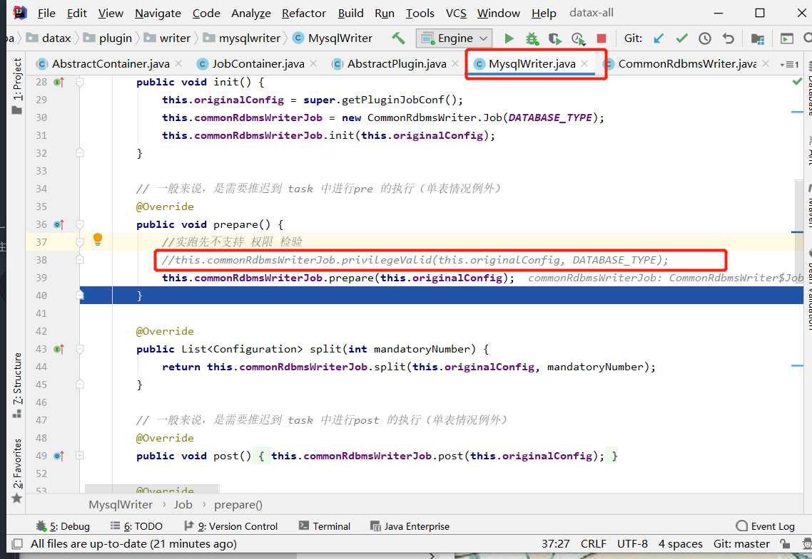

# Job是standalone模式下DataX的总任务



## `this.preHandle()`
尚未实现
## `this.init()`
+ reader和writer的初始化
+ 根据job-id设置当前线程名，小于0时设置为0，其它不变
+ 先reader，后writer初始化，主要是初始化jobReader和jobWriter对象，设置readConfig和writerConfig，并绑定PluginCollector

## `this.prepare()`
+ mysqlreader中未实现
+ 对writer中的preSql进行处理，只有表为1时才走这个方法，其他走task，对preSql数组遍历处理（rdbms中的处理都一样），暂时不支持用户权限认证，不过开发者有实现这个方法，可以把注释打开(未实测)
 

## `this.split()`
```
执行reader和writer最细粒度的切分，需要注意的是，writer的切分结果要参照reader的切分结果，达到切分后数目相等，才能满足1：1的通道模型，所以这里可以将reader和writer的配置整合到一起，然后，为避免顺序给读写端带来长尾影响，将整合的结果shuffler掉
```
1.  并发线程数逻辑（流控模式）adviceNumber = needChannelNumber
三种控制方式及优先级：字节流 = 记录流 > 通道  
（当字节流和记录流都配置时，选取计算后并发通道数最小的）
    1. 字节限制  
关联参数：`job.setting.speed.byte`,`core.transport.channel.speed.byte`  
前者时总流控，后者是单个通道流控，如要使用字节流，则二者都必须配置，都要大于0，总流控不可突破，单个通道可能突破
具体通道数算法，并发通道数 = （int)总流控/单个流控 > 0 ? 通道数 ： 1
```
int needChannelNumberByByte = (int) (job.setting.speed.byte）/（core.transport.channel.speed.byte);
needChannelNumberByByte = needChannelNumberByByte > 0 ? needChannelNumberByByte : 1;
```
    1. 记录流  
关联参数：`job.setting.speed.record`,`core.transport.channel.speed.record`  
前者时总流控，后者是单个通道流控，如要使用记录流，则二者都必须配置，都要大于0，总流控不可突破，单个通道可能突破
具体通道数算法，并发通道数 = （int)总流控/单个流控 > 0 ? 通道数 ： 1
```
int needChannelNumberByRecord = (int) (job.setting.speed.record）/（core.transport.channel.speed.record);
needChannelNumberByRecord = needChannelNumberByRecord > 0 ? needChannelNumberByRecord : 1;
```
    1. channel指定  
关联参数：`job.setting.speed.channel`
指定即可  
1. reader和writer配置切分
    1. reader切分 [切分后](./split/readerTaskConfigs.md)
         + 表模式 -- 单表  
无`splitPk`：切分份数 =  (int)Math.ceil(并发通道数 / 表个数) = 并发通道数  
有`splitPk`：切分份数 = (int)Math.ceil((并发通道数 / 表个数 )) * 5 = 并发通道数 * 5  + 1 （考虑长尾）
         + 表模式 -- 多表  
无`splitPk`：切分份数 =  (int)Math.ceil(并发通道数 / 表个数)  
有`splitPk`：切分份数 = (int)Math.ceil(并发通道数 / 表个数) * 表个数  （是否考虑长尾未注意）
         + 语句模式  
切分份数= querySql.length
    1. writer切分
        + 单表
切分份数 = reader份数
        + 多表
1. transformer对象加载 (未开源)

```
DataX作为一个服务于大数据的ETL工具，除了提供数据快照搬迁功能之外，还提供了丰富数据转换的功能，让数据在传输过程中可以轻松完成数据脱敏，补全，过滤等数据转换功能，另外还提供了自动groovy函数，让用户自定义转换函数。详情请看DataX3的transformer详细介绍。
```

## `this.schedule()`  
```
schedule首先完成的工作是把上一步reader和writer split的结果整合到具体taskGroupContainer中,同时不同的执行模式调用不同的调度策略，将所有任务调度起来
```
schedule是核心，另起一篇[shedule篇章](./schedule.md)

## `this.post()`

## `this.postHandle()`

## `this.invokeHooks()`
